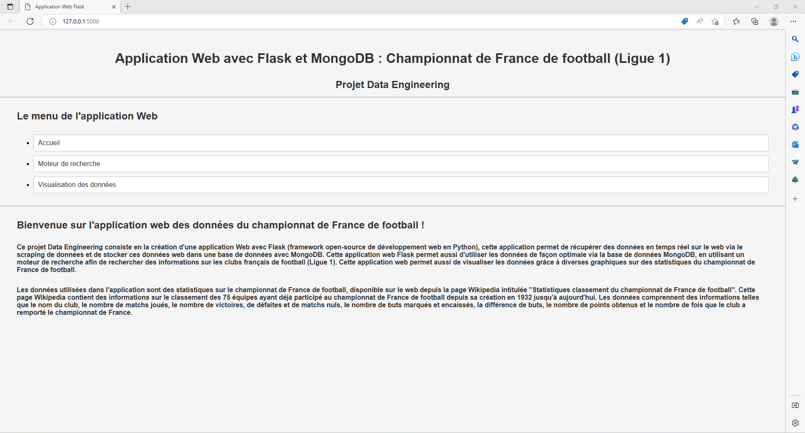
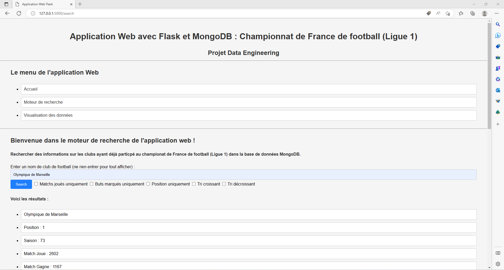
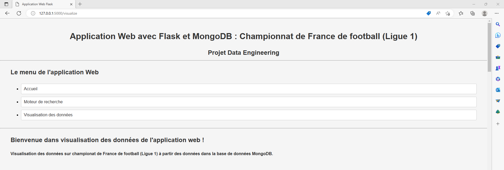
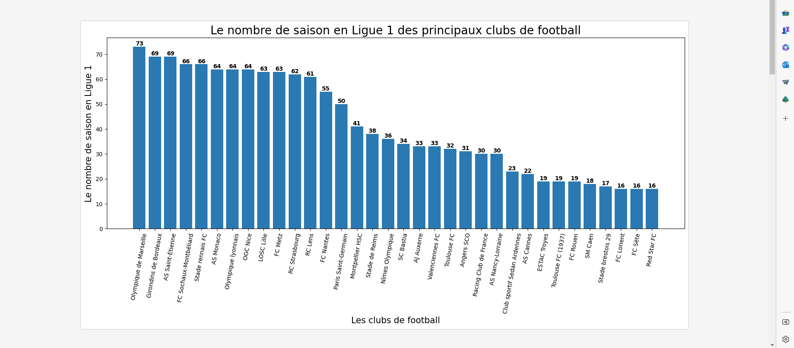

# Projet Data Engineering : Création d'une application Web avec Flask et MongoDB


## Introduction du projet

### Description du projet  
Ce **projet Data Engineering** consiste en la création d'une **application Web** avec **Flask** (framework open-source de développement web en Python), cette application permet de récupérer des données en temps réel sur le web via le scraping de données et de stocker ces données web dans une base de données avec **MongoDB**. Cette application Web Flask permet aussi d'afficher les données de façon optimale grâce à MongoDB en utilisant un moteur de recherche afin de rechercher des informations sur les clubs français de football (Ligue 1). Cette application web permet aussi de visualiser les données grâce à diverses graphiques sur des statistiques du championnat de France de football.

Ce projet contient tous les fichiers pour créer cette application web qui permet de visualiser et rechercher diverses **statistiques** sur le **championnat de France de football** : la **Ligue 1**. L'application utilise des données récupérées sur le web depuis la page [Wikipedia sur des statistiques de la Ligue 1](https://fr.wikipedia.org/wiki/Classement_du_championnat_de_France_de_football_toutes_saisons_confondues).


## Information du projet

- Contributeurs du projet : Antonin, Joaquim et Islaan.
- Date de la dernière mise à jour : 26 février 2023


### Contexte du projet
L'application Web Flask permet de mettre en œuvre 5 choses :
- Création de **templates** pour le design de l'aplication Web (code HTML et CSS),
- **Scraping** de données web en temps réel (avec la librairie python : BeautifulSoup),
- Stockage des données dans une **base de données** (avec MongoDB : système de gestion de base de données orienté documents),
- Création d'une interface et d'un **moteur de recherche** pour interroger la base de données,
- Création d'une interface et d'un **dashborad** pour visualiser les graphiques à partir des données de la base de données (avec la librairie python : Matplotlib).


## Les données Web

### Présentation des données
Les données présentées et utilisées dans l'application sont des statistiques sur le championnat de France de football, disponible sur le web depuis la page Wikipedia intitulée ["Statistiques classement du championnat de France de football"](https://fr.wikipedia.org/wiki/Classement_du_championnat_de_France_de_football_toutes_saisons_confondues). Cette page Wikipedia contient des informations sur le classement de toutes les équipes (les 75 équipes) ayant participé au championnat de France de football depuis sa création en 1932 jusqu'à aujourd'hui.

Les données comprennent des informations telles que le nom du club, le nombre de matchs joués, le nombre de victoires, de défaites et de matchs nuls, le nombre de buts marqués et encaissés, la différence de buts, le nombre de points obtenus et le nombre de fois que le club a remporté le championnat de France.

À noter que les données brutes nécessitent un traitement (data processing) pour pouvoir être utilisées efficacement dans ce projet. Le traitement des données comprendre plusieurs étapes comme le nettoyage, la transformation et la création de nouvelles variables. Ces étapes permettent de rendre les données plus cohérentes, complètes et exploitables, ce qui facilite leur analyse et leur utilisation dans ce projet.

Une fois que les données ont été collectées et traitées, elles peuvent être utilisées pour effectuer des analyses et afficher des graphiques. Dans le projet, nous utiliserons ces données pour visualiser les performances des différentes équipes dans le championnat de France de football au fil des années.


## Installation

### Prérequis du projet
- [logiciel mongoDB compass](https://www.mongodb.com/)
- [python 3.6 ou supérieur](https://www.python.org/downloads/)
- [flask](https://pypi.org/project/Flask/)
- [pandas](https://pandas.pydata.org/)
- [matplotlib](https://matplotlib.org/)
- [requests](https://pypi.org/project/requests/)
- [beautifulsoup4](https://pypi.org/project/beautifulsoup4/)
- [pymongo](https://pypi.org/project/pymongo/)


### Utilisation de MongoDB Compass
Dans notre projet, nous utilisons le logiciel [MongoDB Compass](https://www.mongodb.com/). Pour l'installation de MongoDB Compass, il suffit de suivre les instructions suivantes :
- Accédez à la [page de téléchargement de "MongoDB Community Server Download"](https://www.mongodb.com/try/download/community).
- Sélectionnez votre système d'exploitation et cliquez sur le bouton "Download".
- Double-cliquez sur le fichier d'installation pour commencer l'installation.
- Acceptez les termes et conditions et cliquez sur "Next".
- Sélectionnez les options d'installation souhaitées et cliquez sur "Next".
- Cliquez sur "Install" pour lancer l'installation.
- Une fois l'installation terminée, cliquez sur "Finish".

MongoDB Compass est maintenant installé sur votre système et vous pouvez l'ouvrir pour vous connecter à votre base de données MongoDB.


### Projet sur Git
Le projet est disponible sur le site [Github](https://github.com/) sur le lien : [https://github.com/antoningr/Application-Web-avec-Flask-et-MongoDB](https://github.com/antoningr/Application-Web-avec-Flask-et-MongoDB). 


### Téléchargement du projet
Il suffit de suivre les instructions pour télécharger un projet Git  :
- Ouvrez votre terminal ou invite de commandes.
- Allez dans le répertoire où vous souhaitez enregistrer le projet.
- Tapez la commande suivante pour cloner le projet depuis le dépôt Git :
```
git clone https://github.com/antoningr/Application-Web-avec-Flask-et-MongoDB
```
- Appuyez sur "Entrée" pour lancer la commande. Git va alors télécharger le projet dans le répertoire actuel.
- Une fois le projet téléchargé, vous pouvez commencer à travailler dessus en utilisant Git pour gérer les modifications de code et les mises à jour.


### Packages et dépendances 
Avant d'exécuter le projet, il faut s'assurer d'avoir tous les packages python soit correctement installé avec les bonnes versions pour pouvoir exécuter cette application.
Pour installer les packages et dépendances du projet, il suffit de suivre les instructions suivantes :
- Ouvrez votre terminal ou invite de commandes.
- Accédez au répertoire du projet à l'aide de la commande cd.
- Installez les packages et dépendances Python répertoriés dans le fichier requirements.txt, utilisez la commande suivante :
```
pip install -r requirements.txt
```
- Une fois l'installation terminée, vous pouvez exécuter le projet.


### Exécution de l'application
Après que le projet soit correctement installée avec tous les paquets et dépendances nécessaires, vous pouvez suivre ces instructions pour l'exécuter l'application web :
- Ouvrez une invite de commande ou une fenêtre de terminal.
- Naviguez vers le répertoire racine de l'application où se trouve le fichier app.py.
- Exécutez la commande suivante pour démarrer l'application web :
```
python app.py
```
- Si l'application démarre correctement, vous devriez voir une sortie similaire à celle qui suit :
```
* Exécution sur http://127.0.0.1:5000/ (Appuyez sur CTRL+C pour quitter)
```
- Ouvrez un navigateur Web, l'application web est accessible à l'adresse [http://127.0.0.1:5000](http://127.0.0.1:5000).
- L'application web devrait maintenant fonctionner et être accessible via un navigateur Web.


### Utilisation de l'application

À partir d'un navigateur Web, l'application web est accessible à l'adresse [http://127.0.0.1:5000](http://127.0.0.1:5000).
L'utilisateur peut maintenant naviguer entre les différentes pages et fonctionnalités de l'application web.


## Fonctionnalités de l'application web

### Page d'accueil de l'application
La page d'accueil de l'application web est la première page que l'utilisateur voit lorsqu'il ouvre l'application. Elle sert à présenter brièvement les fonctionnalités de l'application et à orienter l'utilisateur vers les différentes sections de l'application.

La page d'accueil de l'application web permet d'introduire l'application et de présenter les données sur le championnat de France de football, toutes saisons confondues depuis sa création en 1932 jusqu'à aujourd'hui.




### Moteur de recherche : recherche de données dans la base de données
Le moteur de recherche est une fonctionnalité qui permet à l'utilisateur de rechercher des données spécifiques dans la base de données de l'application. L'utilisateur peut entrer des noms de clubs de football et utiliser divers filtres pour limiter les résultats affichés. Cette fonctionnalité est particulièrement utile pour les utilisateurs qui cherchent à trouver des informations précises ou à comparer des données entre elles.



### Exemples de requêtes pour le moteur de recherche

#### Pour obtenir les informations sur un seul club
```
Rechercher : "Olympique de Marseille"
```
```
Voici les résultats :
Olympique de Marseille
Position : 1
Saison : 73
Match Joue : 2602
Match Gagne : 1167
Match Nul : 660
Match Perdu : 775
But Pour : 4191
But Contre : 3324
Difference : 867
Points Totals : 2994
Derniere Saison : Club actuellement en Ligue 1
Championnat Actuel : Ligue 1
Titres Totales : 9
Pourcentage Match Gagne : 0.44850115295926213
Pourcentage Match Nul : 0.2536510376633359
Pourcentage Match Perdu : 0.297847809377402
But Pour par Match en Moyenne : 1.610684089162183
But Contre par Match en Moyenne : 1.277478862413528
Difference par Match en Moyenne : 0.3332052267486549
Points Totals par Match en Moyenne : 1.15065334358186
But Pour par Saison en Moyenne : 57.41095890410959
But Contre par Saison en Moyenne : 45.534246575342465
Difference par Saison en Moyenne : 11.876712328767123
Points Totals par Saison en Moyenne : 41.013698630136986
Pourcentage Titres par Saison : 0.1232876712328767
```


#### Pour obtenir le nombre de buts marqués dans l'ordre croissant de tous les clubs contenants "FC" dans leur nom de club
```
Rechercher : "FC" + Buts marqués uniquement + Tri croissant
```
```
Voici les résultats :
Hyères FC a marqué 22 buts
Istres FC a marqué 25 buts
FC Gueugnon a marqué 27 buts
Gazélec FC Ajaccio a marqué 37 buts
FC Martigues a marqué 105 buts
Paris FC a marqué 150 buts
Tours FC a marqué 217 buts
Dijon FCO a marqué 222 buts
Le Mans FC a marqué 238 buts
FC Mulhouse a marqué 291 buts
FC Antibes a marqué 296 buts
FC Lorient a marqué 686 buts
Red Star FC a marqué 717 buts
FC Nancy a marqué 794 buts
FC Sète a marqué 826 buts
FC Rouen a marqué 859 buts
Toulouse FC (1937) a marqué 1072 buts
Toulouse FC a marqué 1281 buts
Valenciennes FC a marqué 1460 buts
FC Nantes a marqué 2812 buts
FC Metz a marqué 2881 buts
Stade rennais FC a marqué 3211 buts
FC Sochaux-Montbéliard a marqué 3386 buts
```

### Pour obtenir le classement de tous les clubs avec le plus de matchs en Ligue 1
```
Rechercher : "" (ne rien écrire) + Matchs joués uniquement + Tri décroissant
```
```
Voici les résultats :
Olympique de Marseille a joué 2602 matchs
Girondins de Bordeaux a joué 2544 matchs
AS Monaco a joué 2356 matchs
AS Saint-Étienne a joué 2532 matchs
Olympique lyonnais a joué 2353 matchs
LOSC Lille a joué 2315 matchs
FC Sochaux-Montbéliard a joué 2368 matchs
OGC Nice a joué 2328 matchs
FC Nantes a joué 2030 matchs
Paris Saint-Germain a joué 1855 matchs
Stade rennais FC a joué 2360 matchs
RC Lens a joué 2221 matchs
RC Strasbourg a joué 2219 matchs
FC Metz a joué 2260 matchs
Stade de Reims a joué 1368 matchs
Montpellier HSC a joué 1462 matchs
AJ Auxerre a joué 1221 matchs
Nîmes Olympique a joué 1310 matchs
SC Bastia a joué 1264 matchs
Toulouse FC a joué 1210 matchs
Valenciennes FC a joué 1214 matchs
Racing Club de France a joué 1020 matchs
AS Nancy-Lorraine a joué 1132 matchs
Angers SCO a joué 1135 matchs
...
```

### Data visualisation : création de graphiques à partir des données
La data visualisation est une fonctionnalité qui permet à l'utilisateur d'analyser les données de l'application en les représentant sous forme de graphiques. Ces graphiques fournissent des informations claires et concises. Cette fonctionnalité est particulièrement utile pour les utilisateurs qui cherchent à visualiser des tendances et des modèles dans les données. L'application propose cinq graphiques qui sont disponibles pour visualiser les données de façon plus intuitive :
- Un graphique de barres pour visualiser le nombre de saisons en Ligue 1 des principaux clubs de football.
- Un graphique de barres pour visualiser le nombre de buts marqués par les clubs football dans l'histoire de la ligue 1.
- Un graphique de barres pour visualiser une comparaison entre le pourcentage de matchs gagnés, nul et perdus des principaux clubs dans l'histoire de la ligue 1.
- Un graphique en nuages de points pour visualiser une comparaison entre le pourcentage de victoire par matchs et les nombres moyens de buts par matchs des clubs de football dans l'histoire de la ligue 1.
- Un graphique de barres pour visualiser le nombre de titres de champion de France remportés par les clubs dans l'histoire de la ligue 1.



